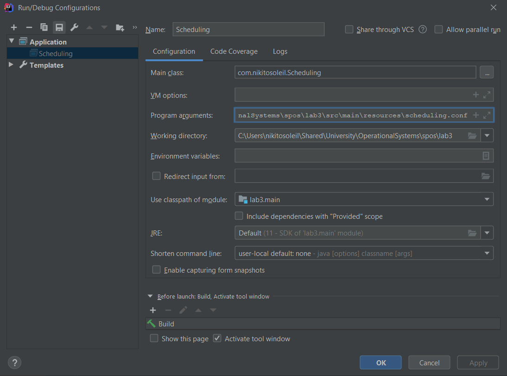
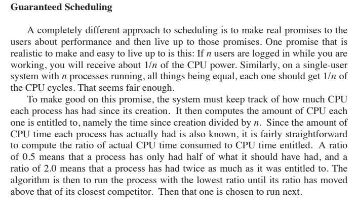

# Implementation of Guaranteed process scheduling algorithm

## How to run

To run the program use similar configuration to the one on screenshot:



Pass the path to the config file through command line arguments

## Changes in config file structure

Each process has 2 values configurable through parameters: timeout after which process is blocked and time it spends blocked

Example of config
```
// # of processes	
numprocess 10

// mean deviation
meandev 200

// standard deviation
standdev 100

// process    # I/O block after  # time in block
process 100 200
process 10 32
process 20 62
process 150 100
process 50 120
process 400 10
process 450 20
process 10 100
process 10 100
process 1000 1000

// simulation duration, in milliseconds
runtime 3500
```
## Changes in output files

Outputs of the simulation can be found at ```res/```

#### Summary-Processes structure

Each 2 lines represent single timestamp: 
- 1st line is currently selected process (if no changes - not printed again)
- 2nd line is status after the timestamp

Process: [process id] [process state] [cpu time needed for process to finish]
[process burst time] [total time process worked without block] [scheduling ratio]

#### Summary-Results structure

Structure is fully described by output file

Example
```
Scheduling Type: Interactive
Scheduling Name: Guaranteed
Simulation Available Time: N
Simulation Run Time: N
Mean: N
Standard Deviation: 100
Process         CPU Time        Block after     Time in block   CPU Completed   CPU Blocked     Final state     Last ratio      
PID             N               N               N               N               N times         N               DOUBLE           
...

Total CPU Needed N
```

# Algorithm explained



